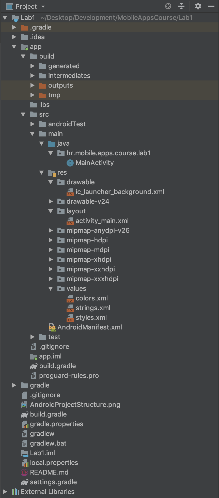

# Lab 1
- [Hello World Android project](#Hello-World-Android-project)
- [Create a new Android Virtual Device](#Create-a-new-Android-Virtual-Device)
- [Android project structure](#Android-project-structure)
- [Explore Android Studio](#Explore-Android-Studio)
---
### Hello World Android project
>Goal of this task is to explore and create your first Android project with Android Studio.
1. [Download and install Android Studio](https://developer.android.com/studio/)
2. Open Android Studio
3. Click on Start a new Android Studio project
4. Explore different project types
5. On tab **Phone and Table** select **Empty Activity**
6. Name the project **HelloWorldAndroid**
7. [Android Package name conventions](https://stackoverflow.com/questions/6273892/android-package-name-convention)
8. Set the package name to **hr.yourname.yoursurname.helloworld** 
   Example: **hr.dominik.koscica.helloworld**
9. Set language to **Java**
10. [Explore Android Dashboards](https://developer.android.com/about/dashboards)
11. Set minimum API level to **API 23 Android 6.0**
12. Enable Use AndroidX artifacts
13. Wait for Gradle process to complete
---
### Create a new Android Virtual Device
>Goal of this task is to create your first Android Virtual Device with Android Studios AVD Manager.
1. Use the Find Action shortcut **(CTRL+Shift+A/Command+Shift+A)**
2. Type **avd** and select **AVD Manager**
3. Click on **Create Virtual Device**
4. Explore device categories
5. In the **Phone** category select **Pixel 2** and click on **Next** button
6. Select the **Recommended** tab Use the latest Android image version: 
   API: **Level 28**
   ABI: **x86**
   Target: **Android 9.0**
7. Click on **Next**
8. Leave the AVD Name as it is
9. Explore Advanced Settings but don't change any setting
10. Click on **Finish**
11. Use the Find Action shortcut **(CTRL+Shift+A/Command+Shift+A)**
12. Type **run** and select **Run app**
13. Select your **Pixel 2** device and enable **Use the same selection for future launches**
14. The Pixel 2 emulator should appear on your screen and the **Hello World app** should open.
---
### Android project structure
>Goal of this task is to get a brief overview of the Android project structure.

A project in Android Studio contains everything that defines your workspace for an app, from source code and assets, to test code and build configurations. When you start a new project, Android Studio creates the necessary structure for all your files and makes them visible in the Project window on the left side of the IDE (click **View > Tool Windows > Project**).

* **build/** contains the compiled output of your app, plus various reports and other files related to the build process and app testing  
* **libs/** contains private libraries
* **src/** contains all code and resource files for the module in the following subdirectories
    * **androidTest/** contains code for instrumentation (UI) tests that run on an Android device
    * **main/** contains the "main" sourceset files: the Android code and resources shared by all build variants (files for other build variants reside in sibling directories, such as src/debug/ for the debug build type)
    * **AndroidManifest.xml** every app project must have an AndroidManifest.xml file (with precisely that name) at the root of the project source set. The manifest file describes essential information about your app to the Android build tools, the Android operating system, and Google Play.
    * **java/** Contains Java code sources. By default Android Studio creates a MainActivity for the application. That will be combined with the package name that you provided for the project to determine the fully-qualified class name for this activity (e.g., **hr.mobile.apps.course.lab1.MainActivity**).
    * **gen/** contains the Java files generated by Android Studio, such as your R.java file and interfaces created from AIDL files.
    * **res/** contains application resources, such as drawable files, layout files, and UI string
        * **res/drawable/** (PNG, JPEG, etc.)
        * **res/layout/** XML-based UI layout specifications
        * **res/menu/** XML-based menu specifications
        * **res/raw/** general-purpose files (audio clip, CSV files)
        * **res/values/** strings, dimensions, colors
        * **res/xml/** other general-purpose XML files
    * **assets/** contains file that should be compiled into an .apk file as-is.
    * **test/** contains code for local tests that run on your host JVM.
    * **build.gradle** defines the module-specific build configurations.
* **build.gradle** defines your build configuration that apply to all modules. This file is integral to the project, so you should maintain them in revision control with all other source code.
* **.gitignore** defines what files should or should not be uploaded to the version control system.
* **proguard-rules.pro** contains rules for a tool called ProGuard, which is used to reduce the size of your app  

[For more details take a look at the official Android documentation](https://developer.android.com/studio/projects)

---
### Explore Android Studio
>Goal of this task is to explore the Android Studio IDE.
1. Read [11 Android Studio Shortcuts every Android Developer must know](https://medium.com/mindorks/11-android-studio-shortcuts-every-android-developer-must-know-a153e736e611)
2. Try out all these 11 shortcuts

---
### License
* Copyright 2019 © Dominik Košćica.
