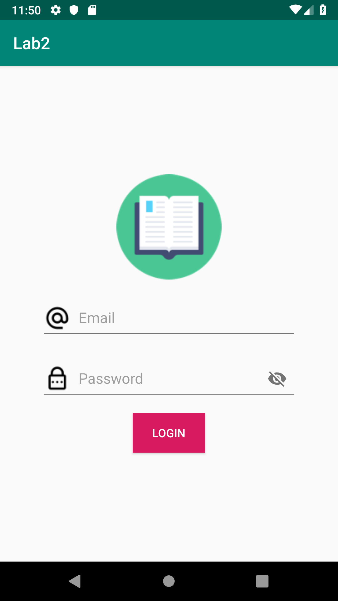
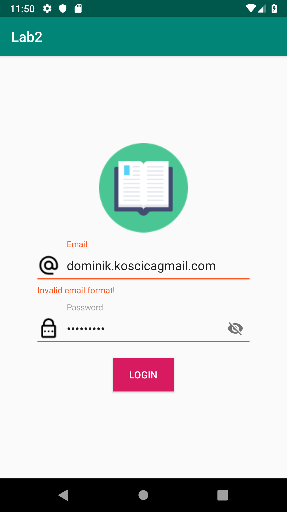

# Lab 2
> Goal of this lab is to introduce Android Views, ViewGroups, Layouts, form validation and resource management.
---
### Update resources
>Goal of this task is to add and update strings files and add one additional localization. 

##### Documentation
* https://proandroiddev.com/what-is-android-app-localization-and-why-should-you-care-e4ba72f867fa

##### Requirements
* Add the following key value pairs to **strings.xml** and add the translated string values to **values-hr/strings.xml**
    
    Key  | Value
    ------------- | -------------
    hint_email  | Email
    hint_password  | Password
    error_email  | Invalid email format!
    error_password  | Invalid password format!
    label_login  | Login
    
---
### Implement Login design
>Goal of this task is to implement the required design.



##### Documentation
* https://guides.codepath.com/android/Working-with-the-EditText
##### Suggestions
* LinearLayout is prefered
##### Resources
* The **res/drawable** folder contains the **logo.png**, **ic_email.png** and **ic_password.png**
##### Requirements
* The **setupView** method in the **LoginActivity** must be used to initialize UI components
* The **email** field must have the following properties:
    * hint and error from **strings.xml** must be used
    * the **inputType** must be **textEmailAddress** 
* The **password** field must have the following properties:
    * hint and error from **strings.xml** must be used
    * the **inputType** must be **textPassword** 
---

### Form validation 
>Goal of this task is to implement validation with a TextWatcher to enable field validation during typing.

##### Documentation
* https://developer.android.com/guide/topics/ui/notifiers/toasts
##### Requirements
* Implement a **TextWatcher** for the **email** & **password** fields 
* Validation for **email** and **password** must be implemented with the help of the **Validator** util class which can be found within the **util** package
* Expand the **Validator** class with an additional method:
    **boolean isValidPassword(String password)** 
    The method should return **true** only when the password is not empty and has at least **5** characters
* If the email and password fields are both valid, display a **Toast** message with the following format
```
    "You have successfully logged in with your email: " + email + " and password: " + password
```
---
### License
* Copyright 2019 © Dominik Košćica.
