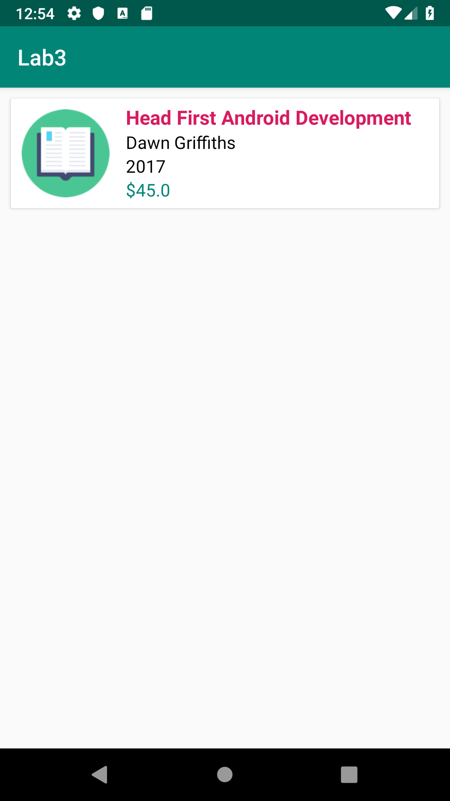

# Lab 4
Goal of this lab is to introduce Intents with complex objects and the RecyclerView.

## 1. BookDetailsActivity
Goal of this task is to create a new **BookDetailsActivity** and open the **BookDetailsActivity** on the book item click in the **HomeActivity**. 
The max point value for this task is **1 point**.

### Lecture
* [Intents](https://drive.google.com/file/d/1PnqYaTrP2rdr8m3DngencTxkG9P3Epes/view)

### Documentation
* https://www.vogella.com/tutorials/JavaSerialization/article.html

### Requirements
* Add the **Serializable** interface to the **Book** model
* Given that the user clicks on the book item in the **HomeActivity** the user should be redirected to the **BookDetailsActivity**
* The intent which is used to start the **BookDetailsActivity** should contain an instance of the **Book** object
* The **openBookDetails(Book book)** method should be used to implement the required intent and start the **BookDetailsActivity**

## 2. RecyclerView
Goal of this task is to implement the BookRecyclerViewAdapter 
The max point value for this task is **3 points**.

### Lecture
* [Intents](https://drive.google.com/file/d/1PnqYaTrP2rdr8m3DngencTxkG9P3Epes/view)
* [RecyclerView](https://drive.google.com/file/d/12fxsNsj3pZ9_1ukdMV8gLTyzDzT9bAHa/view)

### Documentation
* https://developer.android.com/guide/topics/ui/layout/recyclerview

### Requirements
* Create a new package with the name **home** and create a new Java class with the name **BookRecyclerViewAdapter** within the **screen** package.
* Drag and drop the **HomeActivity** file to the **home** package. The **home** package should contain the **HomeActivity** and **BookRecyclerViewAdapter** files.
* Implement the **BookRecyclerViewAdapter** and reuse the **rv_item_book.xml** layout.
* Given that the user clicks on the RecylcerView item the user should be redirected to the **BookDetailsActivity**. Use the **openBookDetails(Book book)** method to redirect the user to the **BookDetailsActivity**

## 3. Basic BookDetailsActivity design
Goal of this task is to implement a basic BookDetailsActivity design. 
The max point value for this task is **1 point**.

### Lecture
* [Intents](https://drive.google.com/file/d/1PnqYaTrP2rdr8m3DngencTxkG9P3Epes/view)

### Requirements
* Retrive the book model from the **Intent bundle** and use the received Book model to implement your basic design to display all relevant information about the received Book model. Feel free to use any layout and View, it's only mandatory that all Book model variables are displayed on the **BookDetailsActivity**.

## License
* Copyright 2019 © Dominik Košćica.