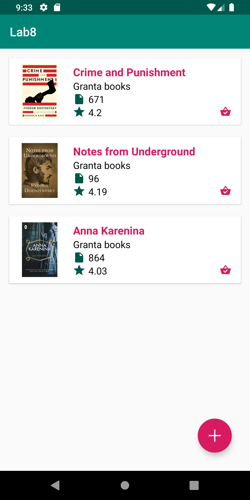
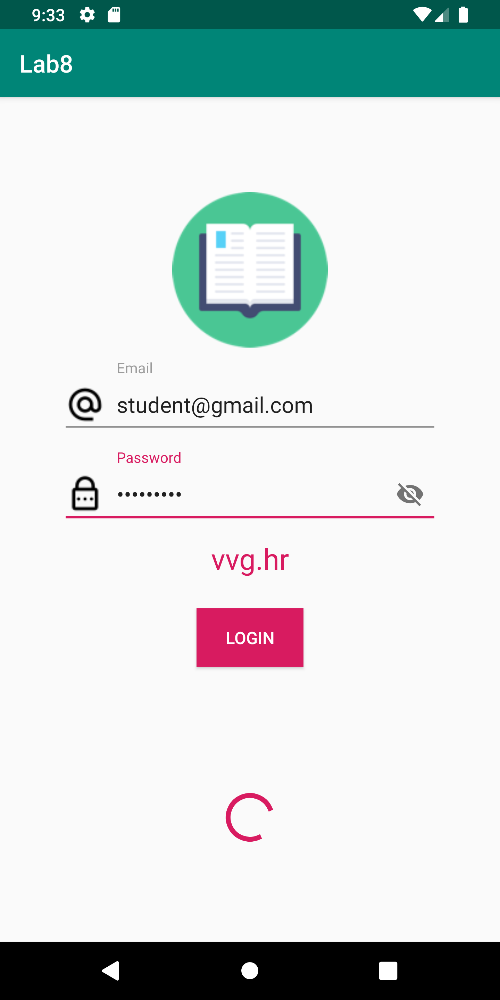
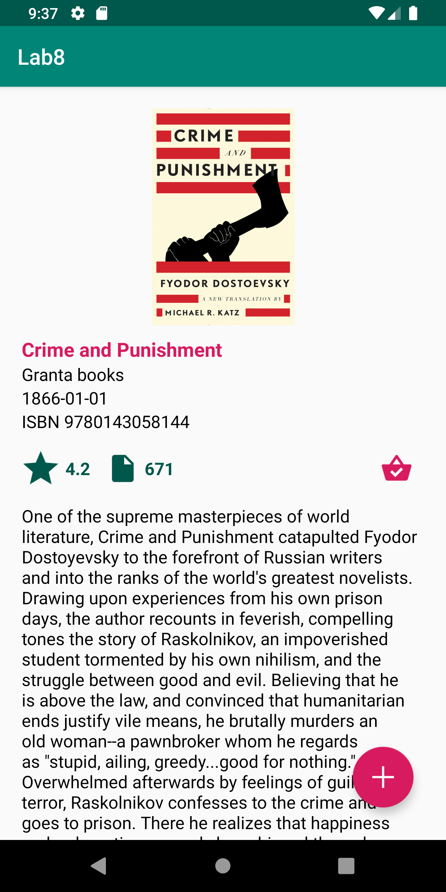

# Lab 8
Goal of this lab is to introduce MultiThreading in Android.

## Prerequisites
* git pull origin master
* Start using the Android Studio built in formatter. Each file that is modified or created must be formatted with the built in formatter.
    * https://medium.com/mindorks/11-android-studio-shortcuts-every-android-developer-must-know-a153e736e611

## 1. SplashScreen
Goal of this task is to implement the SplashScreen.</br>
The max point value for this task is **1 point**.

### Lecture
* [Multithreading](https://drive.google.com/file/d/1jw2LpuoUQDfyV_--AQJyokFiMREODXn7/view)

### Documentation
* https://developer.android.com/guide/components/processes-and-threads

### Design


### Requirements
* Create a new **splash** package within the **screen** package and add a java class with the name **SplashActivity** within the **screen/splash** package.
* Implement the required design.
    * Use the **SystemUtil.hideSystemUI** method to hide the status and navigation bar.
    * Use **androidx.core.widget.ContentLoadingProgressBar** component to display a progress indicator
* Create a **SplashViewModel** class within the **splash** package.
* The **SplashViewModel** must implement the **LiveData<String> retrieveToken()** method
* The **LiveData<String> retrieveToken()** method must use an instance of the **AuthInteractorMockImpl** class to retrieve the token.
* Add the **MutableLiveData<String> retrieveToken()** method to the **AuthInteractor** interface.
* The **MutableLiveData<String> retrieveToken()** method within the **AuthInteractorMockImpl** should return the **Mock.Credentials.TOKEN**
* Add the following code snippet to the **SplashActivity** class
    ```java
    private static final int DELAY_IN_MS = 2000;
    ```
* Use the **Handler** class within the **SplashActivity** to fake a long running network call by calling the **splashViewModel.retrieveToken()** method after a short delay. Use the **DELAY_IN_MS** constant to set a specific delay value.
* Given that the **splashViewModel.retrieveToken().observe** method call returns a empty or null String redirect the user to the **LoginActivity** with the help of **startWithClearTask** method within the **IntentUtil** class.
* Given that the **splashViewModel.retrieveToken().observe** method call returns a token (not null or empty) redirect the user to the **HomeActivity** with the help of **startWithClearTask** method within the **IntentUtil** class.

## 2. Update models and
Goal of this task is to update the app models.</br>
The max point value for this task is **1 point**.

### Design


* Implement the **Book** class regarding the following UML diagram: https://drive.google.com/file/d/1_Bh0xYxwjIBzYgB9c5GszN5E_B0FksGB/view
* Create a new **Publisher** class within the **model** package and implement the **Publisher** class regarding the following UML diagram: https://drive.google.com/file/d/1_Bh0xYxwjIBzYgB9c5GszN5E_B0FksGB/view
* Add a the following code snippet to the Mock class.
  ```java
    public static final List<Book> BOOKS = new ArrayList<Book>() {{
        add(new Book(1,
                "Crime and Punishment",
                1, 671, "1866-01-01", 4.20, 9780143058144L, 5,
                "https://images-na.ssl-images-amazon.com/images/I/71CcO-jvRUL.jpg",
                "One of the supreme masterpieces of world literature, Crime and Punishment catapulted Fyodor Dostoyevsky to the forefront of Russian writers and into the ranks of the world's greatest novelists. Drawing upon experiences from his own prison days, the author recounts in feverish, compelling tones the story of Raskolnikov, an impoverished student tormented by his own nihilism, and the struggle between good and evil. Believing that he is above the law, and convinced that humanitarian ends justify vile means, he brutally murders an old woman--a pawnbroker whom he regards as \"stupid, ailing, greedy...good for nothing.\" Overwhelmed afterwards by feelings of guilt and terror, Raskolnikov confesses to the crime and goes to prison. There he realizes that happiness and redemption can only be achieved through suffering. Infused with forceful religious, social, and philosophical elements, the novel was an immediate success. This extraordinary, unforgettable work is reprinted here in the authoritative Constance Garnett translation.",
                "2019-05-02 12:39:35",
                "2019-05-02 12:39:35",
                new ArrayList<>(), new ArrayList<>(),
                new Publisher(1, "Granta books", "2019-05-02 12:39:35", "2019-05-02 12:39:35")));
        add(new Book(2,
                "Notes from Underground",
                1, 96, "1864-01-01", 4.19, 9780486270531L, 6,
                "https://images-na.ssl-images-amazon.com/images/I/51G45Mh83iL.jpg",
                "Dostoevsky’s most revolutionary novel, Notes from Underground marks the dividing line between nineteenth- and twentieth-century fiction, and between the visions of self each century embodied. One of the most remarkable characters in literature, the unnamed narrator is a former official who has defiantly withdrawn into an underground existence. In full retreat from society, he scrawls a passionate, obsessive, self-contradictory narrative that serves as a devastating attack on social utopianism and an assertion of man’s essentially irrational nature.",
                "2019-05-02 12:39:35",
                "2019-05-02 12:39:35",
                new ArrayList<>(), new ArrayList<>(),
                new Publisher(1, "Granta books", "2019-05-02 12:39:35", "2019-05-02 12:39:35")));
        add(new Book(3,
                "Anna Karenina",
                1, 864, "1851-01-01", 4.03, 9780140449174L, 20,
                "https://images-na.ssl-images-amazon.com/images/I/51No5KBspvL._SX321_BO1,204,203,200_.jpg",
                "Some people say Anna Karenina is the single greatest novel ever written, which makes about as much sense to me as trying to determine the world's greatest color. But there is no doubt that Anna Karenina, generally considered Tolstoy's best book, is definitely one ripping great read. Anna, miserable in her loveless marriage, does the barely thinkable and succumbs to her desires for the dashing Vronsky. I don't want to give away the ending, but I will say that 19th-century Russia doesn't take well to that sort of thing.",
                "2019-05-02 12:39:35",
                "2019-05-02 12:39:35",
                new ArrayList<>(), new ArrayList<>(),
                new Publisher(1, "Granta books", "2019-05-02 12:39:35", "2019-05-02 12:39:35")));
    }};
    ```
* Use the **Mock.BOOKS** within **BookRepository** **setupRepository** method.
* Update the **BookRVFragment**, **BookRecyclerViewAdapter** classes and implement the required design.

## 3. LoginScreen
Goal of this task is to update the LoginScreen design and to fake a API call delay.</br>
The max point value for this task is **2 point**.

### Lecture
* [Multithreading](https://drive.google.com/file/d/1jw2LpuoUQDfyV_--AQJyokFiMREODXn7/view)

### Documentation
* https://developer.android.com/guide/components/processes-and-threads

### Design


### Requirements
* Implement the required design. Use **androidx.core.widget.ContentLoadingProgressBar** component to display a progress indicator
* The progress bar should be shown before the **loginViewModel.loginUser(email, password).observe** method is called.
* The progress bar should be hidden after the **loginViewModel.loginUser(email, password).observe** has been called.
* Add the following code snippet to the **AuthInteractorMockImpl** class
    ```java
    private static final int DELAY_IN_MS = 2000;
    ```
* Modify the **MutableLiveData<User> login(String email, String password)** method within the **AuthInteractorMockImpl**. Use the **Thread** class to fake a long running network call. Use the **DELAY_IN_MS** constant to set a specific delay value.

## 4. BookDetailsScreen
Goal of this task is to implement the BookDetailsScreen design.</br>
The max point value for this task is **1 point**.

### Documentation
* https://developer.android.com/guide/topics/resources/string-resource

### Design


### Requirements
* Update the **BookDetailsFragment** and implement the required design.
* Given that the user clicks on the FAB button show a Snackbar message with the following message: **"${bookName} added to your book collection!"**.
* String formatting must be used to format the message

## License
* Copyright 2019 © Dominik Košćica.